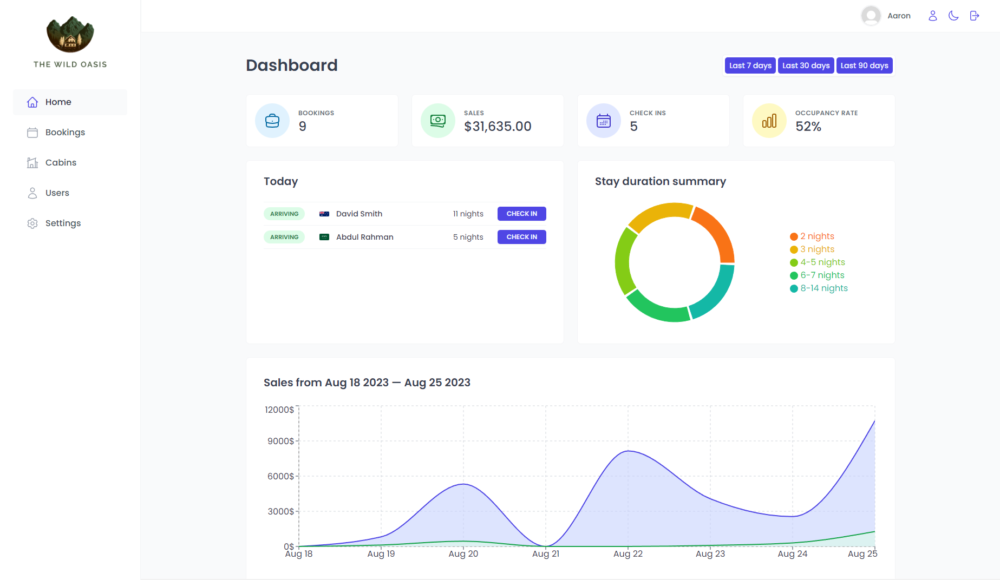

# The Wild Oasis

## Technologies

- HTML
- CSS
- JavaScript
- Date fns
- React.js
- Recharts
- React Icons
- React Hot Toast
- React Router Dom
- React Query
- Supabase
- Styled Components
- Tailwind.css
- Video.js
- Vite

## Link Website

https://the-wild-oasis-fabian.vercel.app

| Email Address  | Password |
| -------------- | -------- |
| test@gmail.com | 12345678 |

## Screenshot

| Login Page                            |
| ------------------------------------- |
|  |

| Dashboard Page                                |
| --------------------------------------------- |
|  |

| Bookings Page                               |
| ------------------------------------------- |
|  |

| Cabins Page                             |
| --------------------------------------- |
|  |

| Create User Page                            |
| ------------------------------------------- |
|  |

| Edit Profile Page                           |
| ------------------------------------------- |
|  |

## Installation

Clone and move to the repository

```bash
git clone https://github.com/AaronFabian/the-wild-oasis.git;
cd the-wild-oasis;
```

# install packages
```bash
npm i
```

# run the server
```bash
npm run dev
```
